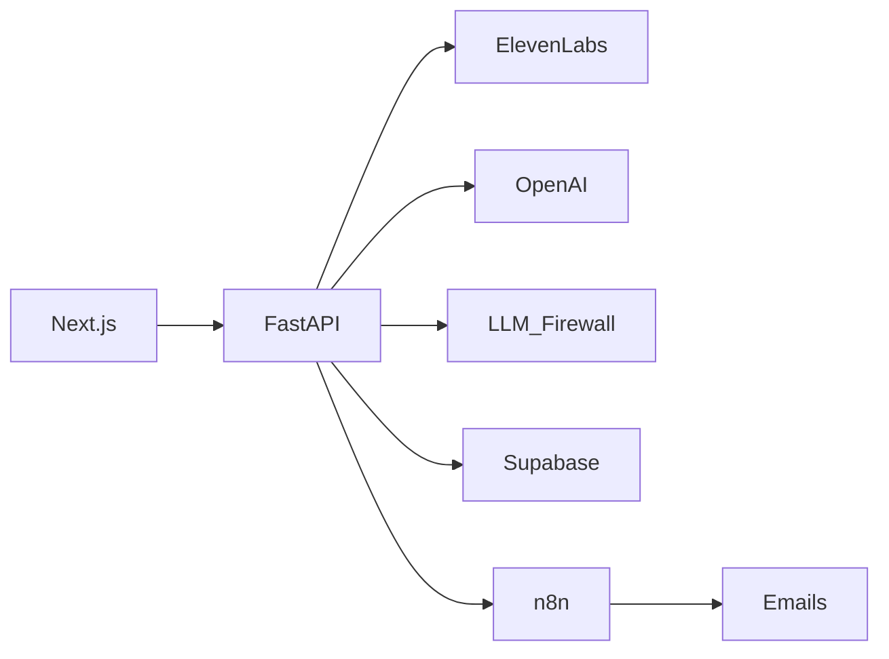

# AI Meeting-to-Tickets PM

> **«La reunión entra por un lado, el plan de trabajo aprobado sale por el otro.»**

Web app que convierte reuniones de requerimientos (audio o texto) en un plan de trabajo estructurado: tickets accionables, asignación inteligente al equipo de IT y notificación automática al aprobar.

**Cursor Buildathon El Salvador · 4-5 julio 2026**

---

## El problema

Las reuniones entre áreas de negocio e IT suelen terminar en notas dispersas, Excel o correos ambiguos. Nadie traduce la conversación en tickets concretos, nadie asigna según skills y carga real, y el plan tarda días en existir — si es que existe.

## La solución

Un manager sube o graba la reunión. El sistema:

1. **Transcribe** el audio a texto (ElevenLabs Scribe)
2. **Extrae** resumen + tickets granulares (OpenAI — Meeting Agent)
3. **Asigna** cada ticket al miembro correcto con % de riesgo (OpenAI — Assignment Agent)
4. Muestra todo en un **board Kanban** con semáforo de riesgo
5. Con **un clic de aprobación**, n8n envía emails a cada asignado

---

## Arquitectura

```
[Navegador / Next.js en Netlify]
        │  (el frontend NUNCA habla directo con la IA)
        ▼
[Backend Python FastAPI]
   ├──► ElevenLabs Scribe     (audio → texto)
   ├──► OpenAI gpt-4o-mini    (transcript → JSON estructurado)
   ├──► LLM Firewall          (valida y redacta el transcript)
   ├──► Supabase              (persistencia)
   └──► n8n webhook           (al aprobar → emails)
```

**Regla de diseño:** el backend es el único que conoce las API keys. El frontend solo pide y muestra.



---

## Stack tecnológico

| Capa | Tecnología |
|------|------------|
| Frontend | Next.js 16, TypeScript, Tailwind CSS 4, Zustand, @dnd-kit |
| Backend | Python 3.11+, FastAPI, Pydantic v2 |
| LLM | OpenAI `gpt-4o-mini` con Structured Outputs |
| Transcripción | ElevenLabs Scribe (`scribe_v1`, español) |
| Base de datos | Supabase (PostgreSQL + RLS) |
| Automatización | n8n (emails al aprobar, cron de deadlines) |
| Deploy | Netlify (frontend) · Render/Railway (backend recomendado) |

---

## Estructura del repositorio

| Carpeta | Contenido |
|---------|-----------|
| [`frontend/`](./frontend) | App Next.js — board Kanban, reuniones, equipo, sistema |
| [`backend/`](./backend) | API FastAPI — agentes IA, transcripción, webhook n8n |
| [`seed/`](./seed) | SQL de Supabase, datos demo, transcripts de ejemplo |
| [`n8n/`](./n8n) | Workflows de n8n (aprobación, deadlines, digest) |
| [`docs/`](./docs) | Presentación PPT, guías, diccionario de DB |
| [`PROYECTO.md`](./PROYECTO.md) | Fuente de verdad del equipo — contrato, roles, guion demo |

---

## Inicio rápido

### 1. Frontend (modo demo — sin backend)

```bash
cd frontend
npm install
npm run dev
```

Abrí [http://localhost:3000](http://localhost:3000). Sin variables de entorno, la app corre en **modo demo** con simulación local fiel al contrato.

### 2. Backend

```bash
cd backend
pip install -r requirements.txt
cp .env.example .env   # completar las keys
uvicorn main:app --reload
```

Docs interactivas: [http://localhost:8000/docs](http://localhost:8000/docs)

### 3. Conectar frontend ↔ backend

En `frontend/.env.local`:

```bash
NEXT_PUBLIC_API_URL=http://localhost:8000
NEXT_PUBLIC_SUPABASE_URL=https://tu-proyecto.supabase.co
NEXT_PUBLIC_SUPABASE_ANON_KEY=eyJ...
```

### 4. Supabase

```bash
# En Supabase SQL Editor, ejecutar en orden:
seed/001_schema.sql
seed/002_seed_demo.sql
seed/004_error_logs.sql
```

Detalle completo: [`docs/SUPABASE_SETUP.md`](./docs/SUPABASE_SETUP.md)

---

## Variables de entorno

### Backend (`backend/.env`)

| Variable | Descripción |
|----------|-------------|
| `SUPABASE_URL` | URL del proyecto Supabase |
| `SUPABASE_SERVICE_ROLE_KEY` | Service role (solo backend, nunca en frontend) |
| `OPENAI_API_KEY` | OpenAI — Meeting y Assignment Agent |
| `ELEVENLABS_API_KEY` | ElevenLabs — transcripción de audio |
| `N8N_WEBHOOK_URL` | Webhook n8n al aprobar un plan (opcional) |
| `OPENAI_MODEL` | Default: `gpt-4o-mini` |

### Frontend (`frontend/.env.local`)

| Variable | Descripción |
|----------|-------------|
| `NEXT_PUBLIC_API_URL` | URL del backend FastAPI |
| `NEXT_PUBLIC_SUPABASE_URL` | URL Supabase (lectura directa) |
| `NEXT_PUBLIC_SUPABASE_ANON_KEY` | Anon key (con RLS) |

---

## Flujo de la aplicación

```
Nueva reunión (audio o texto)
  → POST /api/transcribe          (ElevenLabs)
  → POST /api/agents/meeting      (LLM Firewall → Meeting Agent → tickets)
  → POST /api/agents/assignment   (Assignment Agent → assignees + risk_pct)
  → Board Kanban                  (PATCH /api/tickets/{id} al mover cards)
  → POST /api/approve/{id}        (n8n → emails al equipo)
```

Guía paso a paso: [`docs/GUIA_PRUEBA_FLUJO.md`](./docs/GUIA_PRUEBA_FLUJO.md)

---

## Endpoints principales

| Método | Ruta | Descripción |
|--------|------|-------------|
| `POST` | `/api/transcribe` | Audio → texto (ElevenLabs) |
| `POST` | `/api/agents/meeting` | Transcript → resumen + tickets |
| `POST` | `/api/agents/assignment` | Asignación por skill y carga |
| `PATCH` | `/api/tickets/{id}` | Actualizar estado / assignee / deadline |
| `POST` | `/api/approve/{requirement_id}` | Aprobar plan + webhook n8n |
| `GET` | `/api/health` | Salud del backend |

Lista completa: [`backend/README.md`](./backend/README.md)

---

## Seguridad

- **API keys** solo en el backend; el frontend nunca las ve.
- **Structured Outputs** de OpenAI — JSON garantizado por schema, sin parseo frágil.
- **LLM Firewall** (`backend/llm_firewall.py`) — valida el transcript antes del Meeting Agent: detecta jailbreaks, SQL malicioso, palabras de riesgo y redacta PII (emails, teléfonos, tarjetas).
- **Anti prompt-injection** — el transcript viaja siempre como mensaje `user`, separado del system prompt.
- **RLS en Supabase** — el frontend usa anon key; escrituras sensibles pasan por el backend.
- **Error tracking** — cada request lleva `X-Request-ID` para correlacionar errores en `error_logs`.

---

## Vistas del frontend

| Ruta | Descripción |
|------|-------------|
| `/` | Dashboard general |
| `/reuniones/nueva` | Subir audio o pegar transcript |
| `/reuniones/[id]` | Board Kanban del requirement |
| `/proyectos` | Vista de proyectos |
| `/equipo` | Miembros del equipo y carga |
| `/equipo/[id]` | Dashboard por developer |
| `/sistema` | Health check + logs de errores |

Detalle: [`FRONTEND.md`](./FRONTEND.md) y [`frontend/README.md`](./frontend/README.md)

---

## n8n — Automatización de emails

Al aprobar un plan, el backend dispara un webhook n8n que:

1. Lee tickets asignados desde Supabase
2. Envía email a cada developer con su ticket
3. Envía resumen al jefe de IT
4. Registra auditoría en `notifications`

Guía: [`n8n/GUIA_INTEGRACION.md`](./n8n/GUIA_INTEGRACION.md)

---

## Documentación adicional

| Documento | Contenido |
|-----------|-----------|
| [`PROYECTO.md`](./PROYECTO.md) | Contrato congelado, roles, guion demo 3 min |
| [`docs/PRESENTACION_PPT.md`](./docs/PRESENTACION_PPT.md) | 6 slides + Q&A para jueces |
| [`docs/DATABASE_DICTIONARY.md`](./docs/DATABASE_DICTIONARY.md) | Diccionario de tablas Supabase |
| [`docs/GUIA_PRUEBA_FLUJO.md`](./docs/GUIA_PRUEBA_FLUJO.md) | Probar el flujo end-to-end |
| [`backend/README.md`](./backend/README.md) | Backend: endpoints, error tracking, diseño |
| [`seed/README.md`](./seed/README.md) | SQL, transcripts demo, outputs cacheados |

---

## Deploy

| Componente | Plataforma recomendada |
|------------|------------------------|
| Frontend | **Netlify** — ver [`frontend/netlify.toml`](./frontend/netlify.toml) |
| Backend | **Render** o **Railway** — `uvicorn main:app --host 0.0.0.0 --port $PORT` |
| DB | **Supabase** (ya en la nube) |
| Emails | **n8n cloud** |

Después del deploy, configurar `NEXT_PUBLIC_API_URL` en Netlify apuntando al backend público.

---

## Coste estimado

~**$0.02 por reunión procesada** (transcripción ElevenLabs + 2 llamadas a gpt-4o-mini).

---

## Roadmap

- Integración Jira / Slack / Teams
- Re-priorización automática con aprobación humana
- Análisis histórico de incumplimiento
- Modo on-premise con modelos locales para datos sensibles

---

## Licencia

Proyecto de hackathon — Cursor Buildathon El Salvador 2026.
