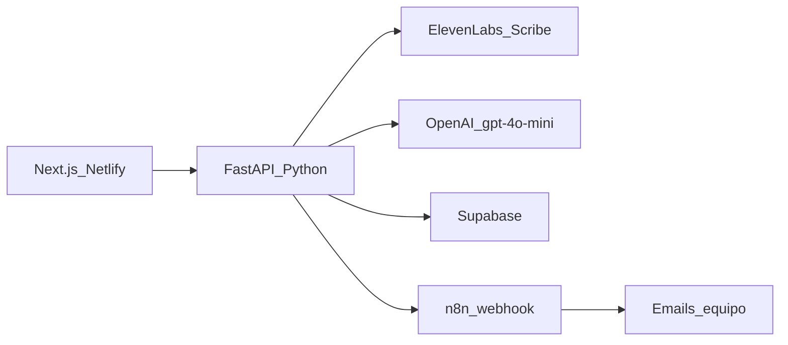

# AI Meeting-to-Tickets PM — Guion de presentación (6 slides)

> Cursor Buildathon El Salvador · 4-5 julio 2026  
> Duración del pitch: ~3 minutos · Fuente de verdad del producto: [`PROYECTO.md`](../PROYECTO.md)

---

## Slide 1 — El problema

**En pantalla (bullets):**
- Las reuniones de requerimientos generan notas, Excel y más reuniones
- Nadie traduce la conversación en un plan de trabajo accionable
- Asignar tareas al equipo correcto sigue siendo manual y subjetivo
- El resultado: retrasos, sobrecarga invisible y tickets mal dimensionados

**Notas del presentador (~20s):**
Empieza con una situación que todos reconocen: Finanzas pide un ERP en una reunión de una hora, y al día siguiente IT recibe un correo vago o un Excel desordenado. Nadie sabe quién hace qué, cuánto tarda ni qué tan riesgoso es. Las reuniones no mueren porque falte gente — mueren porque no hay un puente entre la conversación y la ejecución.

**Frase hook (opcional en pantalla):**
*«La reunión entra por un lado, el plan de trabajo aprobado sale por el otro.»*

---

## Slide 2 — La solución

**En pantalla (bullets):**
- **AI Meeting-to-Tickets PM** — de reunión a plan aprobado en minutos
- El manager sube audio o pega el transcript de la reunión
- La IA extrae resumen + tickets granulares y accionables
- Cruza skills y carga del equipo → asignación con % de riesgo
- Un clic de aprobación → emails automáticos a cada asignado

**Notas del presentador (~40s):**
Presentamos una web app pensada para PMs y jefes de IT. Subís o grabás la reunión con otra área; el sistema transcribe, entiende qué pidieron, descompone el trabajo en tickets concretos — no «hacer landing», sino fases ejecutables — y los asigna según quién sabe qué y cuánto tiene en la mesa. El jefe revisa el board Kanban, ve el semáforo de riesgo y aprueba con un clic. A partir de ahí, el equipo recibe su plan sin volver a interpretar la reunión.

**Flujo en 4 pasos (visual sugerido):**
```
Transcribir  →  Extraer tickets  →  Asignar equipo  →  Aprobar y notificar
```

---

## Slide 3 — Arquitectura

**En pantalla (bullets):**
- Frontend **Next.js** en Netlify — solo UI, sin llaves secretas
- Backend **FastAPI** (Python) — único punto de acceso a IA y DB
- **ElevenLabs Scribe** — audio → texto en español
- **OpenAI gpt-4o-mini** — Meeting Agent + Assignment Agent (Structured Outputs)
- **Supabase** — persistencia · **n8n** — emails al aprobar
- **LLM Firewall** — valida y redacta el transcript antes del agente

**Diagrama (proyectar o incluir en slide):**



**Notas del presentador (~40s):**
La regla de diseño es simple: el navegador nunca habla directo con OpenAI ni ElevenLabs. Todo pasa por nuestro backend Python, que concentra las API keys. Usamos Structured Outputs de OpenAI para que la respuesta siempre respete el schema JSON — cero parseo frágil. Antes de mandar el transcript al Meeting Agent, un LLM Firewall detecta jailbreaks, SQL malicioso y datos sensibles; si el contenido es aceptable, redacta PII y deja pasar el texto sanitizado. Al aprobar, n8n consulta Supabase y manda los correos. Serverless donde importa; backend liviano donde hace falta control.

---

## Slide 4 — Demo en vivo

**En pantalla (bullets):**
1. Grabar ~30s de audio en vivo (jefa de finanzas pide un ERP)
2. Transcripción automática (ElevenLabs)
3. Meeting Agent → resumen + tickets granulares (2-6 s)
4. Assignment Agent → board Kanban con semáforo de riesgo
5. **Aprobar plan** → email llegando al celular en pantalla partida

**Momentos clave para señalar en vivo:**
- **Beto en rojo** — backend al 85% de carga → riesgo alto
- **Elena sin tickets** — skill devops/redes, no aplica al requerimiento
- QR a la URL de Netlify: *«Está deployado, úsenlo ahora»*

**Respaldos si algo falla:**
- Video grabado (H10.5)
- Outputs cacheados en `/seed/cached/`
- Plan B: pegar transcript manual en el textarea

**Notas del presentador (~60s):**
Este slide acompaña la demo, no la reemplaza. Narrá encima de la espera del agente: «Aquí la IA está leyendo la reunión y generando tickets que un PM podría ejecutar mañana». Cuando aparezca el board, señalá el semáforo: verde abajo de 40, amarillo 40-70, rojo arriba de 70. El momento wow es el clic en Aprobar y el email llegando en vivo. Si el WiFi falla, tenés el video y los mocks listos — pero el flujo mínimo no negociable es: transcript → tickets → board → aprobar.

---

## Slide 5 — Roadmap

**En pantalla (bullets):**
- Integración con **Jira / Slack / Teams** (donde ya vive el equipo)
- Re-priorización automática con **aprobación humana**
- Análisis histórico de incumplimiento y deadlines
- Modo **on-premise** con modelos locales para datos sensibles
- Coste orientativo: **~$0.02 por reunión procesada**

**Lo que dejamos fuera hoy (roadmap explícito):**
- Ingesta del organigrama real de la empresa
- Mover deadlines automáticamente sin revisión
- Análisis histórico profundo de incumplimiento

**Notas del presentador (~20s):**
Hoy demostramos el pipeline completo de punta a punta en un hackathon. El siguiente paso natural es conectar las herramientas que las empresas ya usan y añadir gobernanza humana sobre las decisiones de la IA. Para organizaciones con datos sensibles, el mismo flujo puede correr on-premise. El costo por reunión es marginal frente al tiempo que hoy pierde un PM transcribiendo y repartiendo tareas a mano.

---

## Slide 6 — Equipo

**En pantalla (bullets):**
- **R1 — [Nombre]** · Backend + IA · FastAPI, OpenAI, ElevenLabs, LLM Firewall
- **R2 — [Nombre]** · Frontend · Next.js, Tailwind, deploy Netlify
- **R3 — [Nombre]** · Datos + automatización · Supabase, n8n, seeds
- **R4 — [Nombre]** · Producto + pitch · guion, deck, demo

**Cierre en pantalla:**
- Cursor Buildathon El Salvador · Julio 2026
- [QR → URL de Netlify]
- *«La reunión entra por un lado, el plan de trabajo aprobado sale por el otro.»*

**Notas del presentador (~20s):**
Presentá al equipo en 10 segundos cada uno — quién hizo qué pilar. Cerrá con el QR a la app deployada e invitá a los jueces a probarla. Si queda tiempo, abrí a preguntas usando el apéndice de abajo.

---

# Apéndice — Respuestas rápidas para Q&A

*No proyectar. Solo para el presentador.*

### ¿Cómo está armada la arquitectura?
«Serverless donde importa — Netlify, Supabase, n8n cloud — y un backend Python liviano que concentra las llaves y la lógica de agentes. Structured Outputs garantiza el JSON: cero parseo frágil de respuestas del LLM.»

### ¿Qué tan seguro es?
«Las API keys viven solo en el servidor. El transcript viaja siempre como mensaje `user`, separado del system prompt, lo que mitiga prompt injection. Además tenemos un LLM Firewall que bloquea jailbreaks, detecta SQL malicioso y redacta PII antes de llamar al agente. Supabase usa RLS por equipo.»

### ¿Cuánto cuesta operarlo?
«Aproximadamente $0.02 por reunión procesada — transcripción + dos llamadas a gpt-4o-mini. Escala linealmente con el volumen de reuniones, no con headcount de IT.»

### ¿Qué pasa si OpenAI o ElevenLabs fallan?
«La demo puede continuar pegando el transcript manualmente. Tenemos outputs cacheados en `/seed/cached/` y un video de respaldo. El backend registra errores en `error_logs` con `request_id` para correlacionar fallos.»

### ¿Por qué no Jira directo hoy?
«El contrato de datos y endpoints está congelado para el hackathon. La integración con Jira/Slack es el primer ítem del roadmap — el pipeline ya produce tickets estructurados listos para exportar.»

---

## Checklist pre-presentación

- [ ] URL de Netlify activa y QR generado
- [ ] Backend corriendo o deployado (`NEXT_PUBLIC_API_URL` configurada)
- [ ] Supabase con seed de demo (`seed/002_seed_demo.sql`)
- [ ] n8n WF1 probado con curl o approve real
- [ ] Video de respaldo en 2 ubicaciones
- [ ] `seed/reset_demo.sql` listo por si los datos quedan sucios tras ensayos
